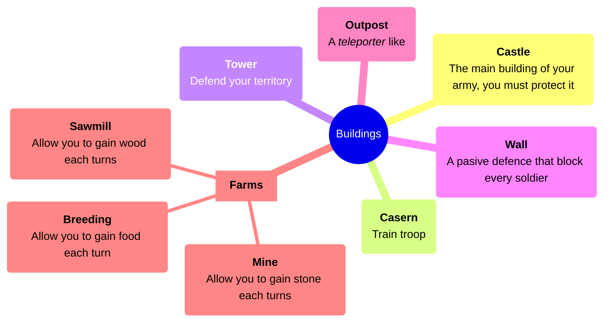
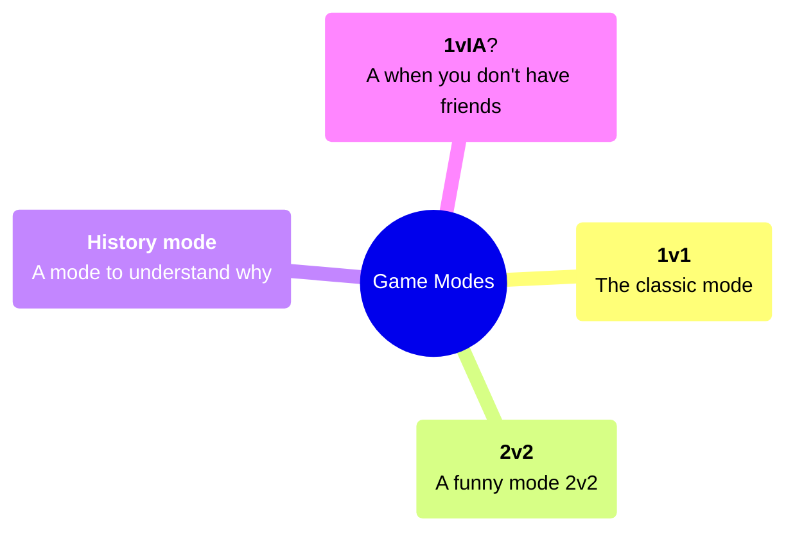
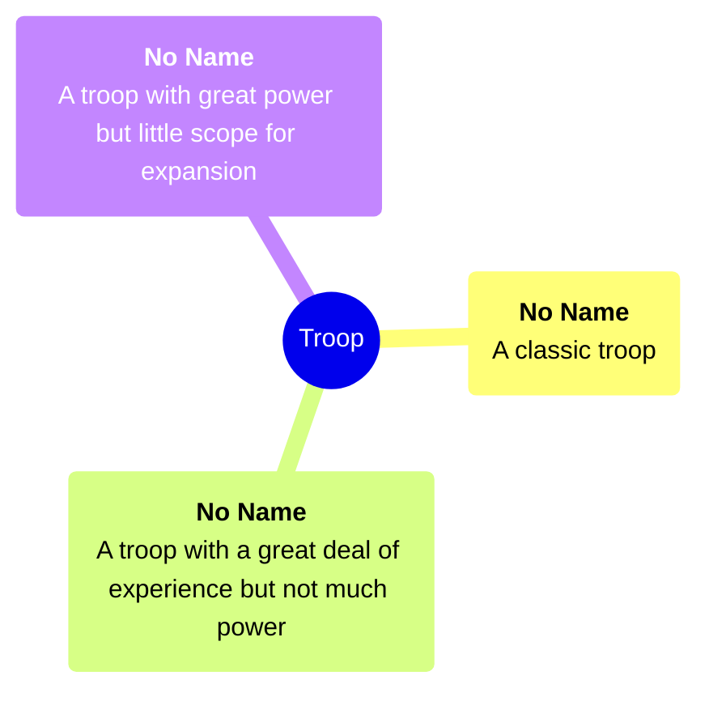

# Border Wars

## Brainstorm 

If you want to know more about our reflexions check this : [all brainstorms](docs/brainstorms/).

## The game

we've decided to make an turn based online game named : **Border Wars**

Code in rust using Bevy 

## Building list

## Game Modes

## Style 

We think to made our game in 2D iso with hexagons.
the overall theme will be fairytale medieval.

## Different troop 

## Balancing

In the future, we'll have to make sure that each troop is both different and balanced. 

## Our team 

our team consists of : 
- [CoCo_Sol](https://github.com/cocosol007): Owner of this project and the main developper
- [Raphaël](https://git.tipragot.fr/raphael): Owner of this project and game designer
- [Tipragot](https://git.tipragot.fr/tipragot): Main reviewer
- [Arthur](https://www.rust-lang.org/): Compositeur
- [Racloody](https://linktr.ee/racloody): Sound designer
- [Horoleysh](https://instagram.com/horoleysh): Artist

