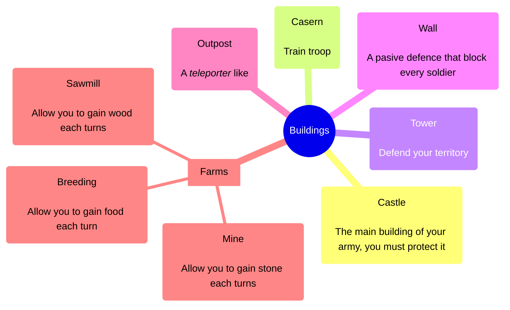
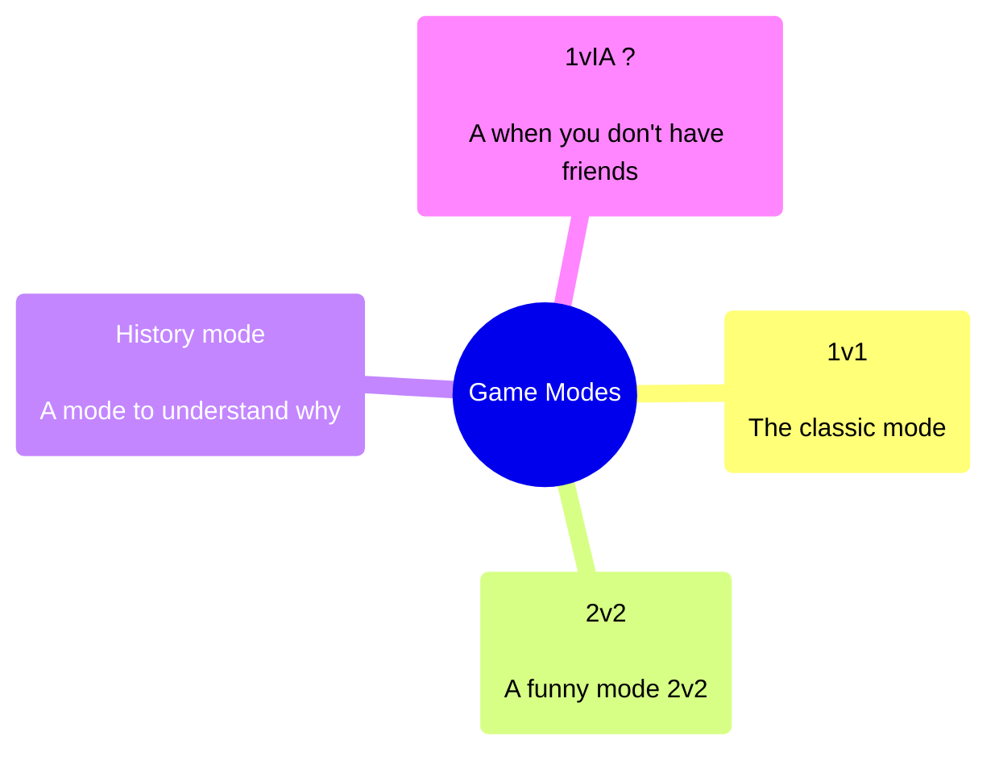
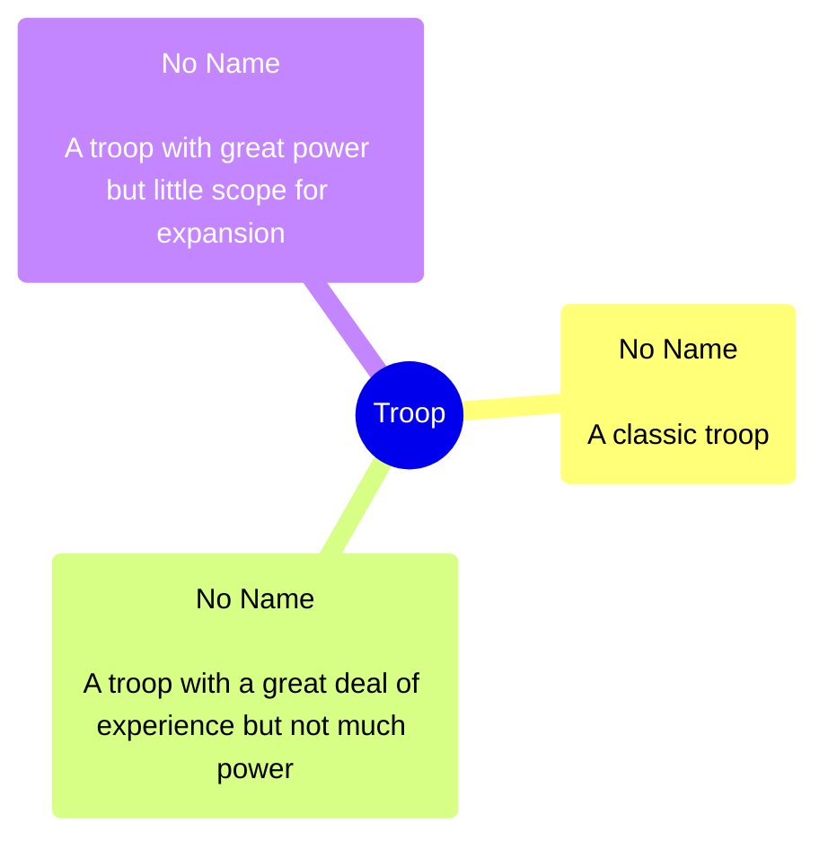

# Brainstorm

we've decided to make an turn based online game named : **Border Wars**

## Building list

## Game Modes

## Style 

We think to made our game in 2D iso with hexagons.
the overall theme will be fairytale medieval.

## Different troop 

## Balancing

In the future, we'll have to make sure that each troop is both different and balanced. 